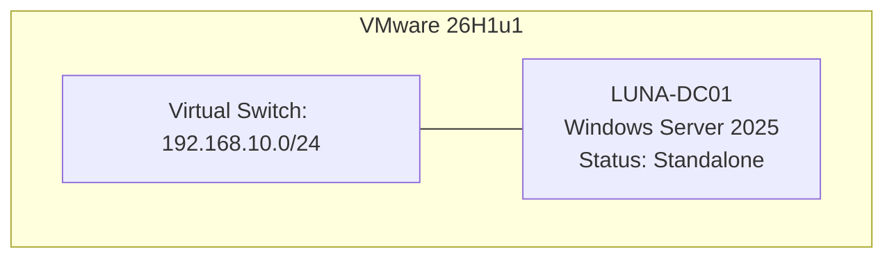

# IT-Support-AD-LAB

# วิเคราะห์โครงสร้าง Lab เบื้องต้น

เป้าหมายคือการสร้าง Active Directory Domain Services (AD DS) ชื่อ `luna.lab` บรอดแคสต์ผ่าน Subnet `192.168.10.0/24` โดยใช้ `LUNA-DC01` เป็นศูนย์กลางจัดการ Policy และ Identity ทั้งหมดของ `LUNA-CL01`
# Initial Mermaid Diagram:

อธิบาย Diagram: ปัจจุบันมีเพียงแค่ Node ของ Virtual Switch ที่ทำการเชื่อมต่อ Edge ไปยัง LUNA-DC01 ซึ่งยังเป็น Standalone Server (ยังไม่มีการติดตั้ง Role ใดๆ)
